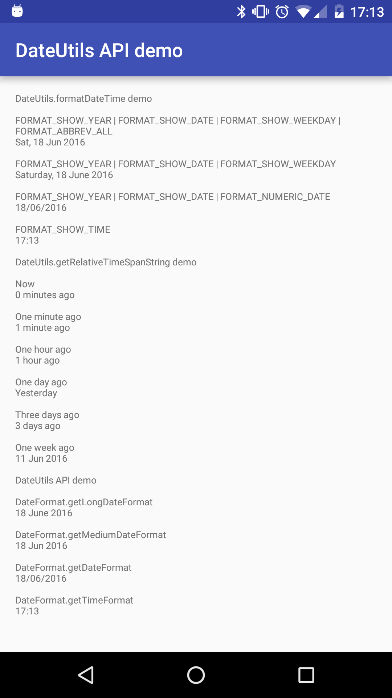

# What is this?
This is demo code of the Android DateUtils class for better internationalization of date indication.

# Why DateUtils?
**DO NOT USE** SimpleDateFormat class for UI text to show date or time in Android apps. Otherwise, your UI text will be grammatically corrupted and not readable in some of Eastern Asian languages. Or simply put (for alphabetical-language-speakers), people in the US may prefer "Sat, Jun 18, 2016" format, people in the UK may prefer "Sat, 18 Jun 2016" format on the other hand. So handling variety types of date format by SimpleDateFormat is not practical.

[DateUtils](https://developer.android.com/reference/android/text/format/DateUtils.html) is here for such purpose. It automatically generates translated text for you, based on the language setting of Android device.

Here is a screen shot comparison of US English and UK English respectively. Other screen shot samples are available in [here](image), the main part of demo code is available in [here](app/src/main/java/jp/f/dev/android/sample/dateutils/MainActivity.java).

